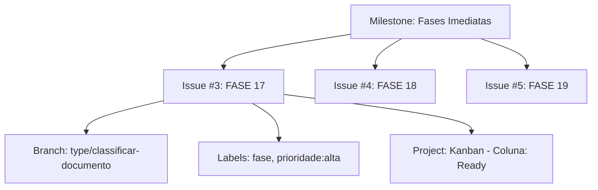
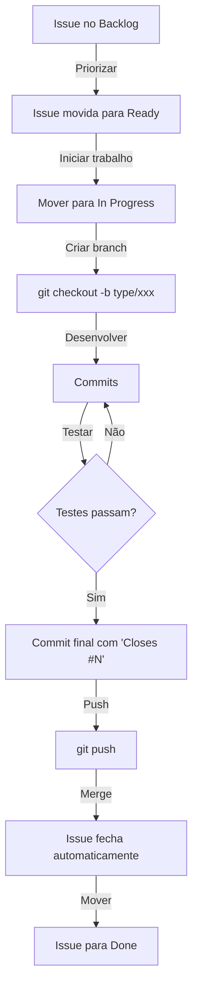

📚 MANUAL COMPLETO - GESTÃO DO PROJETO SHOWTRIALS

<div align="center">Todos os comandos para gerenciar issues, milestones, projects e branches pelo terminal

</div>---

📋 ÍNDICE

1. Filosofia do Fluxo de Trabalho
2. Conceitos Fundamentais
3. Issues
4. Milestones
5. Projects
6. Labels
7. Branches e Commits
8. Workflows Diários
9. Checklists Rápidos

---

🎯 FILOSOFIA DO FLUXO DE TRABALHO

Por que usar Projects + Milestones + Kanban?

Antes de mergulhar nos comandos, é importante entender por que escolhemos essa estrutura e como ela se alinha com nosso jeito de trabalhar.

O Problema que Resolvemos

Antes Depois
❌ Fases espalhadas na cabeça ✅ Tudo documentado em issues
❌ Sem noção de prioridade ✅ Labels: alta/média/baixa
❌ Prazos perdidos ✅ Milestones com datas
❌ Progresso invisível ✅ Kanban visual
❌ Commits sem contexto ✅ Commits linkados às issues
❌ Dificuldade de planejar ✅ Roadmap claro

Nossa Filosofia: "Commits Atômicos por Funcionalidade"

Como você já pratica, cada branch type/* representa uma unidade de trabalho completa:

· ✅ Adiciona telemetria
· ✅ Cria testes de lógica
· ✅ Cria testes de telemetria
· ✅ Corrige MyPy
· ✅ Aumenta cobertura

Agora, com o GitHub Projects, cada issue no Kanban representa exatamente uma dessas branches.

---

📊 CONCEITOS FUNDAMENTAIS

O que é cada coisa e para que serve

Ferramenta O que é Para que serve
Issue Uma tarefa individual Representa uma fase do projeto (ex: FASE 17)
Label Categoria/etiqueta Classifica por tipo, prioridade, área
Milestone Um marco com prazo Agrupa issues por período (Semanas 1-2, 3-4, etc.)
Project Um quadro Kanban Visualiza o fluxo de trabalho (Backlog → In Progress → Done)
Branch Uma linha do tempo no Git Onde o código é desenvolvido

Como eles se relacionam



Nosso Fluxo (O Ciclo de Vida de uma Fase)

```
📋 BACKLOG → ✅ READY → ⏳ IN PROGRESS → 👀 IN REVIEW → ✅ DONE
     ↓            ↓              ↓               ↓             ↓
   Planejado   Pronto para   Desenvolvendo    Aguardando    Concluído
                começar                       merge
```

---

1️⃣ ISSUES

Criar uma nova issue (fase)

```bash
# Template completo - use sempre este padrão
gh issue create --title "FASE 17: classificar_documento.py" \
  --body "## 🎯 Objetivo
Aumentar cobertura de 65% para 85%

## 📊 Métricas Atuais
- **Cobertura:** 65%
- **Linhas não cobertas:** 18
- **Telemetria:** ❌ Ausente
- **MyPy:** ✅ OK

## 📋 Tarefas
- [ ] Adicionar padrão de telemetria
- [ ] Expandir testes existentes
- [ ] Criar testes de telemetria
- [ ] Verificar cobertura final

## ⏱️ Estimativa: 2-3 horas" \
  --label "fase,tipo/testes,prioridade:alta" \
  --milestone "Fases Imediatas (Semanas 1-2)"
```

Listar issues

```bash
# Todas as issues abertas
gh issue list

# Todas (abertas e fechadas)
gh issue list --state all

# Filtrar por milestone
gh issue list --milestone "Fases Imediatas (Semanas 1-2)"

# Filtrar por label
gh issue list --label "prioridade:alta"
gh issue list --label "fase"

# Filtrar por quem está trabalhando
gh issue list --assignee "rib-thiago"

# Limitar quantidade (padrão 30)
gh issue list --limit 50
```

Ver detalhes de uma issue

```bash
# Visão básica
gh issue view 3

# Com comentários
gh issue view 3 --comments

# Em formato JSON (para scripts)
gh issue view 3 --json number,title,labels,milestone
```

Editar uma issue

```bash
# Adicionar labels
gh issue edit 3 --add-label "prioridade:alta"

# Remover labels
gh issue edit 3 --remove-label "prioridade:media"

# Mudar milestone
gh issue edit 3 --milestone "Fases Imediatas (Semanas 1-2)"

# Mudar título
gh issue edit 3 --title "FASE 17: classificar_documento.py (atualizado)"

# Atribuir a alguém
gh issue edit 3 --add-assignee "rib-thiago"

# Múltiplas alterações de uma vez
gh issue edit 3 --add-label "urgente" --milestone "Fases Imediatas"
```

Fechar e reabrir issues

```bash
# Fechar manualmente
gh issue close 3

# Fechar com comentário
gh issue close 3 --comment "Resolvido, cobertura atingiu 85%"

# Reabrir (se necessário)
gh issue reopen 3
```

Comentar em issues

```bash
# Adicionar comentário
gh issue comment 3 --body "Iniciando desenvolvimento hoje"

# Comentar e fechar (combinação útil)
gh issue comment 3 --body "Finalizado!" && gh issue close 3
```

---

2️⃣ MILESTONES

Por que usamos milestones?

Milestones agrupam issues por período de entrega. Isso nos ajuda a:

· 📅 Manter o foco no que precisa ser feito agora
· 🎯 Visualizar o progresso em direção a um objetivo
· ⏱️ Estimar se estamos no prazo

Nossos milestones:

· Fases Imediatas (Semanas 1-2) - O que estamos fazendo AGORA
· Melhorias (Semanas 3-4) - Próximo bloco
· Inovação (Semanas 5-6) - Futuro
· Documentação (Contínuo) - Tarefas contínuas

Ver milestones (via site)

```bash
# Abrir no navegador (milestones não têm CLI)
open https://github.com/rib-thiago/showtrials-tcc/milestones
```

Listar issues de um milestone

```bash
gh issue list --milestone "Fases Imediatas (Semanas 1-2)"
```

Ver progresso do milestone

```bash
# Pelo site
open https://github.com/rib-thiago/showtrials-tcc/milestones

# Percentual de conclusão aparece como barra de progresso
```

---

3️⃣ PROJECTS

Por que usamos Kanban?

O Kanban nos dá visibilidade do fluxo:

· 📋 Backlog: Ideias que não vamos fazer agora
· ✅ Ready: Próximas tarefas priorizadas
· ⏳ In Progress: O que está sendo feito
· 👀 In Review: Aguardando validação
· ✅ Done: Concluído

Isso responde a perguntas como:

· "O que está travado?" → olhe In Progress há muito tempo
· "O que vem depois?" → olhe Ready
· "O que já fizemos?" → olhe Done

Comandos para Projects

```bash
# Listar seus projects
gh project list --owner rib-thiago
# Saída esperada: ID e título do project

# Ver detalhes do project (visão geral)
gh project view 1 --owner rib-thiago

# Ver itens do project (issues)
gh project item-list 1 --owner rib-thiago
```

Adicionar issue ao project

```bash
# Formato: gh project item-add <issue-number> --owner <owner> --url <issue-url>
gh project item-add 3 --owner rib-thiago --url https://github.com/rib-thiago/showtrials-tcc/issues/3
```

Mover issue entre colunas (recomendo fazer pelo site)

```bash
# Se você INSISTIR em fazer pelo terminal (mais complexo):

# PASSO 1: Pegar o ID do item (difícil de achar)
gh project item-list 1 --owner rib-thiago --format json

# PASSO 2: Usar o ID para mover
gh project item-edit --id <ITEM-ID> --field "Status" --value "In Progress"
```

Abrir project no navegador (recomendado)

```bash
open https://github.com/users/rib-thiago/projects/1
```

---

4️⃣ LABELS

Por que usamos labels?

Labels categorizam as issues para:

· 🔴 prioridade:alta → O que fazer primeiro
· 🟡 prioridade:media → Importante, mas não urgente
· 🟢 prioridade:baixa → Quando sobrar tempo
· 🏷️ fase → É uma fase do projeto
· 🧪 tipo/testes → Relacionado a testes
· 🔧 tipo/qualidade → Melhoria de código
· 📚 tipo/documentação → Documentação
· ⚙️ tipo/infra → Infraestrutura/CI
· ✨ melhoria → Melhoria de funcionalidade
· 🎨 ux → Experiência do usuário

Listar todas as labels

```bash
gh label list
```

Criar nova label

```bash
# Formato: gh label create <nome> --color <cor-hex> --description <descrição>
gh label create "tipo/performance" --color "1d76db" --description "Melhorias de performance"
```

Editar label

```bash
gh label edit "prioridade:alta" --color "b60205" --description "Urgente - fazer agora"
```

Deletar label

```bash
gh label delete "tipo/performance"
```

---

5️⃣ BRANCHES E COMMITS

Por que o padrão type/*?

Seguimos o padrão type/* porque:

· 🌿 Identifica claramente o tipo de trabalho
· 🔗 Relaciona diretamente com a issue correspondente
· 📚 Histórico organizado e pesquisável
· 🤝 Facilita revisão de código

Criar branch para uma fase

```bash
# Sempre seguir o padrão: type/nome-do-arquivo
git checkout -b type/classificar-documento   # para FASE 17
git checkout -b type/obter-documento         # para FASE 18
git checkout -b type/estatisticas            # para FASE 19
```

Commits atômicos (seu padrão)

```bash
# Commits intermediários (opcionais)
git add .
git commit -m "wip: adiciona estrutura básica de testes para classificar_documento"

# IMPORTANTE: Commit final com fechamento da issue
git add src/application/use_cases/classificar_documento.py
git add src/tests/test_classificar_documento.py
git add src/tests/test_classificar_documento_telemetry.py

git commit -m "feat: adiciona telemetria e testes em classificar_documento.py

- Adiciona padrão de telemetria
- Cria testes de lógica (8) e telemetria (5)
- Cobertura: 65% → 85%

Closes #3"
```

Push e merge

```bash
# Enviar branch
git push origin type/classificar-documento

# Criar Pull Request (opcional, pode mergear direto)
gh pr create --title "FASE 17: classificar_documento.py" \
  --body "Closes #3" \
  --base main

# Ver PRs abertos
gh pr list

# Fazer merge (após aprovação)
gh pr merge 3 --merge
```

Ver branches

```bash
git branch          # locais
git branch -a       # todas (incluindo remotas)
git branch -d type/classificar-documento  # deletar branch local após merge
```

---

6️⃣ WORKFLOWS DIÁRIOS

Fluxo Completo de uma Fase (do início ao fim)



Checklist: Iniciar o dia

```bash
# 1. Ver o que está em andamento
gh issue list --assignee "@me"

# 2. Ver o que é prioridade
gh issue list --label "prioridade:alta"

# 3. Ver project status
open https://github.com/users/rib-thiago/projects/1

# 4. Ver branch atual
git branch
```

Checklist: Iniciar uma nova fase

```bash
# 1. No site, mover issue de "Ready" para "In Progress"

# 2. Criar branch
git checkout -b type/classificar-documento

# 3. Verificar estado atual do arquivo
ls -la src/application/use_cases/classificar_documento.py
poetry run pytest --cov=src/application/use_cases/classificar_documento.py
poetry run mypy src/application/use_cases/classificar_documento.py
```

Checklist: Durante o desenvolvimento

```bash
# Rodar testes do arquivo específico
poetry run pytest src/tests/test_classificar_documento.py -v

# Rodar MyPy no arquivo
poetry run mypy src/application/use_cases/classificar_documento.py

# Ver cobertura atual
poetry run pytest --cov=src/application/use_cases/classificar_documento.py
```

Checklist: Finalizar uma fase

```bash
# 1. Verificar se tudo está verde
poetry run pytest src/tests/test_classificar_documento.py -v
poetry run mypy src/application/use_cases/classificar_documento.py

# 2. Ver cobertura final
poetry run pytest --cov=src/application/use_cases/classificar_documento.py

# 3. Commit final com "Closes"
git add .
git commit -m "feat: adiciona telemetria e testes em classificar_documento.py

- Adiciona padrão de telemetria
- Cria testes de lógica (8) e telemetria (5)
- Cobertura: 65% → 85%

Closes #3"

# 4. Push
git push origin type/classificar-documento

# 5. Fazer merge (via site ou CLI)
gh pr create --title "FASE 17" --body "Closes #3"
gh pr merge 3 --merge

# 6. No site, mover issue para "Done"

# 7. Deletar branch local (opcional)
git branch -d type/classificar-documento
```

---

7️⃣ CHECKLISTS RÁPIDOS

Comandos mais úteis (cola rápida)

```bash
# Issues
gh issue list                          # listar abertas
gh issue list --state all               # todas
gh issue view 3                         # ver detalhes
gh issue create                          # criar nova
gh issue edit 3 --add-label "fase"       # adicionar label
gh issue close 3                          # fechar

# Projects
gh project list                          # listar
gh project view 1 --owner rib-thiago     # ver
gh project item-add 3 --owner rib-thiago --url https://github.com/.../issues/3

# Labels
gh label list                            # listar
gh label create "tipo/ux" --color "1d76db"

# Milestones (consulta apenas)
gh issue list --milestone "Fases Imediatas"

# Git
git checkout -b type/classificar-documento
git commit -m "feat: ... Closes #3"
git push origin type/classificar-documento
```

Labels que usamos

Label Cor Significado
fase 🟣 É uma fase do projeto
tipo/testes 🟢 Relacionado a testes
tipo/qualidade 🔵 Melhoria de código
tipo/documentação 🟤 Documentação
tipo/infra 🔵 Infraestrutura/CI
melhoria 🟡 Melhoria de funcionalidade
ux ⚪ Experiência do usuário
prioridade:alta 🔴 Fazer agora
prioridade:media 🟡 Fazer em breve
prioridade:baixa 🟢 Quando sobrar tempo

---

🎯 EXEMPLO PRÁTICO: FASE 17 (classificar_documento.py)

```bash
# 1. Ver issue #3
gh issue view 3

# 2. No site: mover issue #3 de "Ready" para "In Progress"

# 3. Criar branch
git checkout -b type/classificar-documento

# 4. Desenvolver (editar arquivos, criar testes)...

# 5. Testar
poetry run pytest src/tests/test_classificar_documento.py -v

# 6. Verificar MyPy
poetry run mypy src/application/use_cases/classificar_documento.py

# 7. Ver cobertura
poetry run pytest --cov=src/application/use_cases/classificar_documento.py

# 8. Commit final
git add src/application/use_cases/classificar_documento.py
git add src/tests/test_classificar_documento.py
git add src/tests/test_classificar_documento_telemetry.py

git commit -m "feat: adiciona telemetria e testes em classificar_documento.py

- Adiciona padrão de telemetria
- Cria testes de lógica (8) e telemetria (5)
- Cobertura: 65% → 85%

Closes #3"

# 9. Push
git push origin type/classificar-documento

# 10. Fazer merge (via site)

# 11. No site: mover issue #3 para "Done"

# 12. Ver progresso
gh issue list --milestone "Fases Imediatas (Semanas 1-2)"
```

---

📊 RESUMO DO FLUXO (VISUAL)

```
📋 BACKLOG → ✅ READY → ⏳ IN PROGRESS → 👀 IN REVIEW → ✅ DONE
     │           │            │               │             │
     │           │            │               │             │
     ▼           ▼            ▼               ▼             ▼
  Planejado   Pronto para   git checkout   gh pr create   Merge + 
              começar       desenvolvimento                Close issue
```

---

🏆 POR QUE ESSE FLUXO FUNCIONA PARA NÓS

1. Alinhado com seu padrão: Cada issue = uma branch type/*
2. Visibilidade: Sabemos exatamente o que está acontecendo
3. Priorização: Labels e milestones mostram o que é importante
4. Rastreabilidade: Commits linkados às issues
5. Progresso mensurável: Cobertura sobe, issues fecham
6. Documentação viva: O histórico do projeto está todo documentado

Agora sim, manual completo! 🚀
