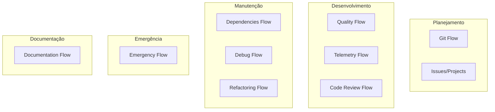

📊 ANÁLISE COMPLETA - TODOS OS FLOWS DO PROJETO

Thiago, excelente pergunta! Vamos revisar tudo o que documentamos e verificar se falta https://chat.deepseek.com/share/n6zivchl2pf4s4j0uj

---

✅ FLOWS JÁ DOCUMENTADOS

# Flow Documento Status
1 Git Flow GIT_FLOW.md ✅ Concluído
2 Quality Flow (lint, testes, cobertura) QUALITY_FLOW.md ✅ Concluído
3 Telemetry Flow TELEMETRY_FLOW.md ✅ Concluído
4 Code Review Flow CODE_REVIEW_FLOW.md ✅ Concluído
5 Dependencies Flow DEPENDENCIES_FLOW.md ✅ Concluído
6 Debug Flow DEBUG_FLOW.md ✅ Concluído
7 Documentation Flow DOCUMENTATION_FLOW.md ✅ Concluído
8 Refactoring Flow REFACTORING_FLOW.md ✅ Concluído
9 Emergency Flow (Hotfix) EMERGENCY_FLOW.md ✅ Concluído

---

🔍 FLOWS QUE PODEMOS CONSIDERAR (OPCIONAIS)

Dependendo do nível de detalhe que você quer, ainda poderíamos documentar:

10. Onboarding Flow (Como começar do zero)

· Clonar repositório
· Instalar Poetry
· Configurar ambiente virtual
· Instalar dependências (incluindo NLP via pip)
· Rodar primeira vez
· Verificar se tudo funciona

11. Release Flow (Já meio que está no Git Flow)

· Atualizar CHANGELOG
· Atualizar versão no pyproject.toml
· Criar tag
· Criar release no GitHub
· Publicar documentação (mkdocs)

12. Backup/Restore Flow

· Backup do banco de dados
· Backup de arquivos exportados
· Como restaurar em caso de perda

13. Performance Flow

· Como identificar gargalos
· Como otimizar queries
· Quando adicionar índices
· Como medir tempo de resposta

14. Security Flow

· Gerenciamento de chaves de API (Google Translate)
· Sanitização de inputs
· Rate limiting
· Boas práticas de segurança

15. Testing Flow (tipos específicos de teste)

· Quando escrever testes unitários vs integração
· Como testar exceções
· Como testar código assíncrono (se houver)
· Property-based testing (Hypothesis)

---

📋 RECOMENDAÇÃO

Essenciais (já temos todos) ✅

Os 9 flows que documentamos cobrem todo o ciclo de vida do desenvolvimento:

· Planejamento: Git Flow, Issues/Projects
· Qualidade: Quality Flow, Telemetry Flow, Code Review Flow
· Manutenção: Dependencies Flow, Debug Flow, Refactoring Flow
· Emergência: Emergency Flow
· Documentação: Documentation Flow

Opcionais (podemos fazer se quiser) 🤔

· Onboarding Flow - útil se outras pessoas forem contribuir
· Release Flow - já está no Git Flow, mas pode ser detalhado
· Performance Flow - para otimizações futuras
· Security Flow - importante para produção
· Testing Flow - aprofundamento em tipos de teste

---

🎯 MINHA SUGESTÃO

Paramos por aqui! Você tem um kit completo de documentação que cobre:

Próximos passos sugeridos:

1. Salvar todos os documentos na pasta docs/flows/
2. Adicionar ao mkdocs.yml para aparecer no site
3. Criar um índice (ex: docs/FLOWS_INDEX.md)
4. Voltar ao desenvolvimento (FASE 17) com tudo documentado

---

📊 RESUMO FINAL

Categoria Flows Status
Planejamento Git Flow ✅
Qualidade Quality, Telemetry, Code Review ✅
Manutenção Dependencies, Debug, Refactoring ✅
Emergência Hotfix ✅
Documentação Documentation ✅
Total 9 flows Completos! 🎉

Parabéns! Agora você tem uma base sólida de documentação de processos. 🚀
